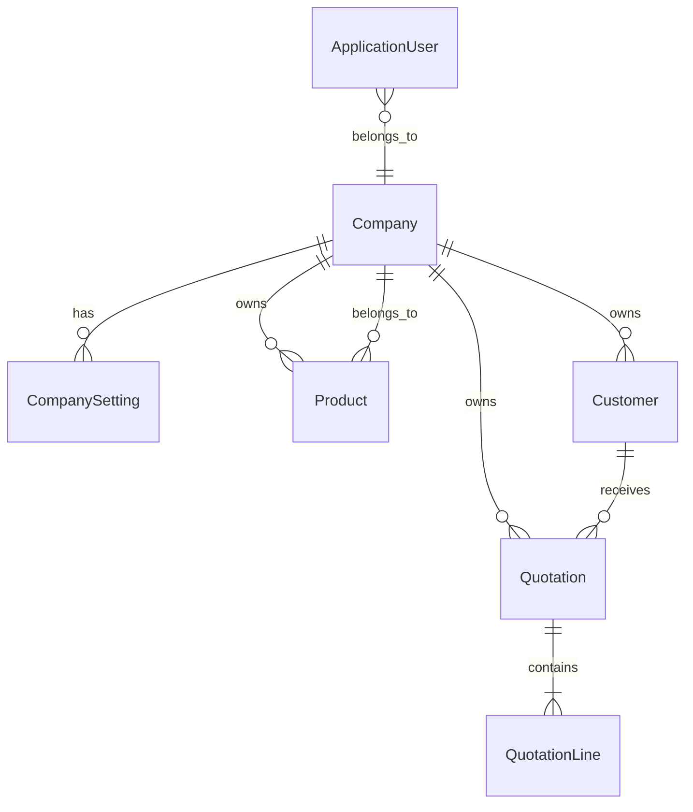

# Data Model

## Entity relationship diagram

## Entities

### Company

| Column | Type | Notes |
|--------|------|-------|
| Id | int PK | |
| Name | string | Required |
| Tagline | string? | |
| Address, City, State, Country, PinCode | string? | Used in PDF header |
| GstNumber, PanNumber | string? | Tax identifiers |
| Mobile, Email, Website | string? | |
| LogoPath | string? | Reserved for future logo upload |

### CompanySetting (key-value)

| Column | Type | Notes |
|--------|------|-------|
| Id | int PK | |
| CompanyId | int FK | |
| Key | string | `PrimaryColor`, `InvoiceTerms`, `InvoiceFooter` |
| Value | string | Setting value |

### Product

| Column | Type | Notes |
|--------|------|-------|
| Id | int PK | |
| CompanyId | int FK | Tenant isolation |
| Name | string | Required |
| Sku | string | Unique per company |
| Barcode | string? | |
| SellingPrice | decimal(18,2) | |
| GstPercent | decimal(5,2) | e.g. 12, 18 |
| CurrentStock | int | Informational in core scope |

### Customer

| Column | Type | Notes |
|--------|------|-------|
| Id | int PK | |
| CompanyId | int FK | |
| Name | string | Required |
| Code | string | Short code |
| Mobile, City, State, Address | string? | |

### Quotation

| Column | Type | Notes |
|--------|------|-------|
| Id | int PK | |
| CompanyId | int FK | |
| QuotationNumber | string | Auto-generated (e.g. QT-0001) |
| CustomerId | int FK | Required |
| QuotationDate | datetime | |
| ValidUntil | datetime | |
| SubTotal, TaxAmount, DiscountAmount, TotalAmount | decimal(18,2) | Computed on save |
| Notes | string? | |

### QuotationLine

| Column | Type | Notes |
|--------|------|-------|
| Id | int PK | |
| QuotationId | int FK | |
| ProductId | int FK | |
| Quantity | decimal(18,2) | Must be > 0 |
| UnitPrice | decimal(18,2) | Snapshot from product |
| DiscountPercent | decimal(5,2) | Line-level discount |
| GstPercent | decimal(5,2) | Snapshot from product |
| LineSubTotal, TaxAmount, TotalAmount | decimal(18,2) | Computed |

### ApplicationUser (Identity)

Extends `IdentityUser` with `CompanyId` (int) for multi-tenant scoping.

## Calculation rules

**Per line:**
1. `lineAmount = quantity × unitPrice`
2. `discount = lineAmount × discountPercent / 100`
3. `lineSubTotal = lineAmount − discount`
4. `taxAmount = lineSubTotal × gstPercent / 100`
5. `totalAmount = lineSubTotal + taxAmount`

**Document:**
- `subTotal` = sum of line subtotals
- `taxAmount` = sum of line taxes
- `totalAmount` = subTotal + taxAmount − quotationDiscountAmount

Implemented in `QuotationCalculator` (Application layer).

## Seed data summary

| Entity | Count |
|--------|-------|
| Company | 1 (Demo Trading Co.) |
| CompanySetting | 3 |
| Product | 6 |
| Customer | 4 |
| User | 2 (Admin, User) |
| Role | 2 |

See `database/setup-notes.md` for connection and migration details.
